# 🎓 Student Management System (SMS)

A **Student Management System (SMS)** developed to streamline and digitize academic and administrative operations in educational institutions.  
This project was built as part of the **MCA (IGNOU) final year project**.

---

## 📌 About the Project

The Student Management System is designed to manage:

- Student records  
- Attendance  
- Exams & results  
- Teachers & classes  
- Communication between stakeholders  

It replaces manual processes with an efficient, secure, and user-friendly system.

---

## 🚀 Features

### 👩‍🎓 Student Management
- Add, update, delete student records  
- View personal & academic details  

### 👨‍🏫 Teacher Management
- Manage teacher profiles  
- Assign subjects & classes  

### 📚 Subject & Class Management
- Create classes and subjects  
- Assign teachers to subjects  

### 📝 Exam & Result Management
- Create exams  
- Enter and manage results  
- Generate reports  

### 📅 Attendance Management
- Mark attendance  
- View attendance reports  

### 🔐 User Management
- Role-based login system (Admin, Teacher, Student, Parent)  
- Authentication & authorization  

### 📢 Notifications
- Announcements & notices  
- Communication between users  

---

## 👥 Actors / Users

- 👨‍💼 Admin  
- 👨‍🏫 Teacher  
- 👩‍🎓 Student  
- 👨‍👩‍👧 Parent  

---

## 🛠️ Tech Stack

**Frontend:**
- HTML5  
- CSS3  
- JavaScript  
- Bootstrap  

**Backend:**
- PHP  

**Database:**
- MySQL (phpMyAdmin)  

**Server:**
- XAMPP / WAMP  

---

## 📊 System Design

- ✔️ Data Flow Diagrams (DFD)  
- ✔️ ER Diagram  
- ✔️ Class Diagram  
- ✔️ Use Case Diagram  
- ✔️ Spiral Model  

---

## ⚙️ Installation & Setup

### Step 1: Install Requirements
- Install **XAMPP / WAMP**
- Install browser (Chrome recommended)

### Step 2: Setup Project
1. Copy project folder to: htdocs
2. 2. Start:
- Apache  
- MySQL  

### Step 3: Database Setup
1. Open **phpMyAdmin**
2. Create database:schoolnew
3. Import: schoolnew.sql

### Step 4: Run Project
http://localhost/your-project-folder

---

## 📸 Project Screenshots

### 🔐 Login Page

  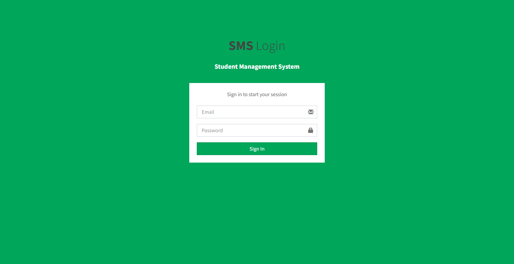

---

### 🏠 Dashboard

  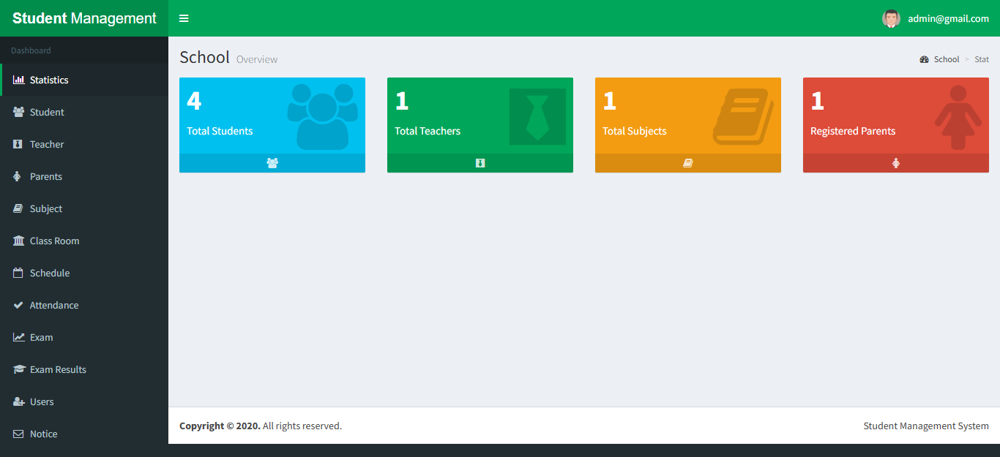

---

### 👩‍🎓 Student Management

  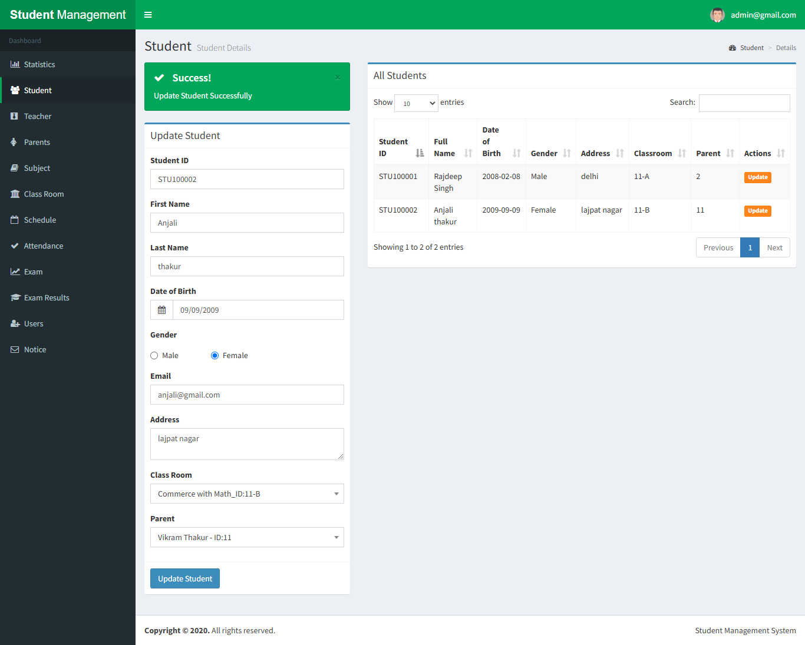

---

### 📅 Teacher Management

  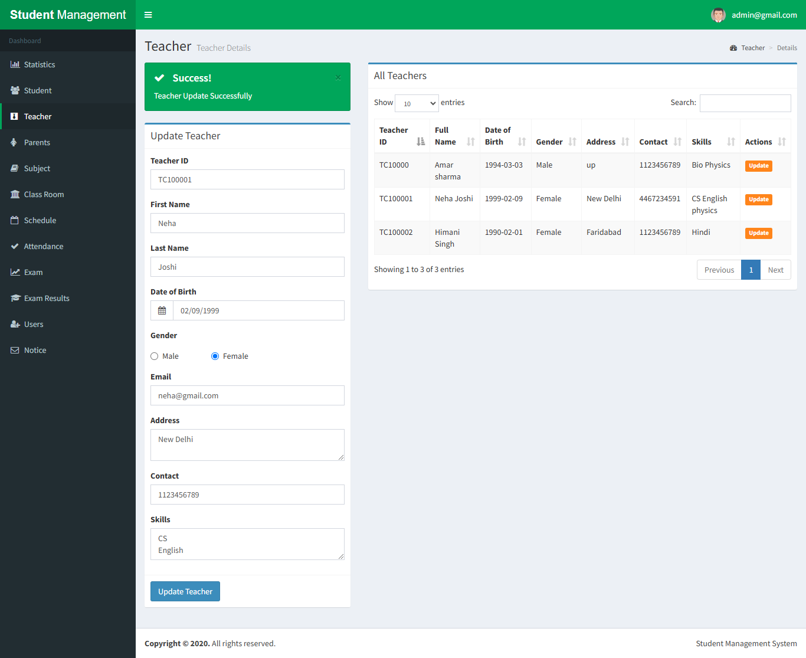

---

### 📅 Parents Management

  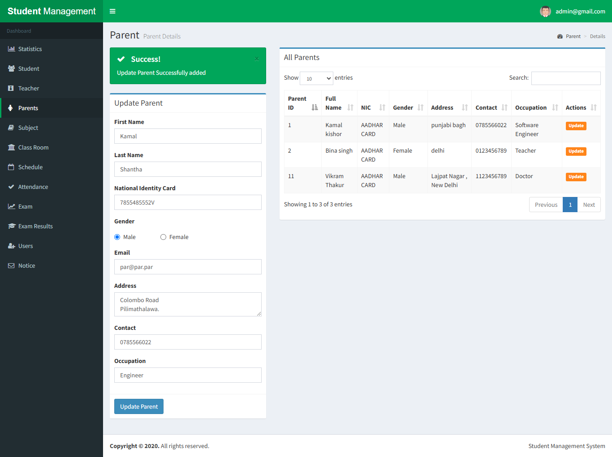

---

---

### 📅 Subject Management

  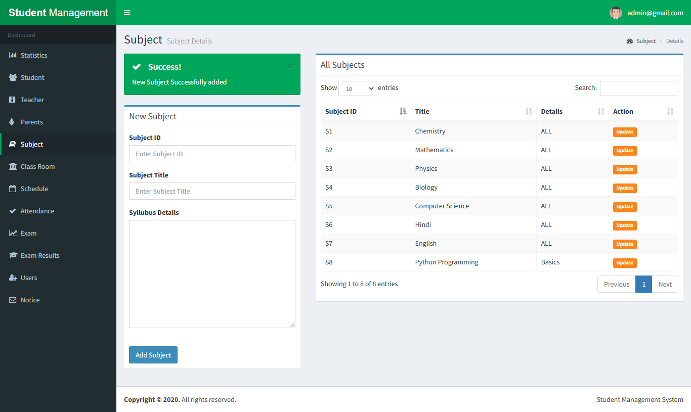

---

### 📅 Class Room Management

  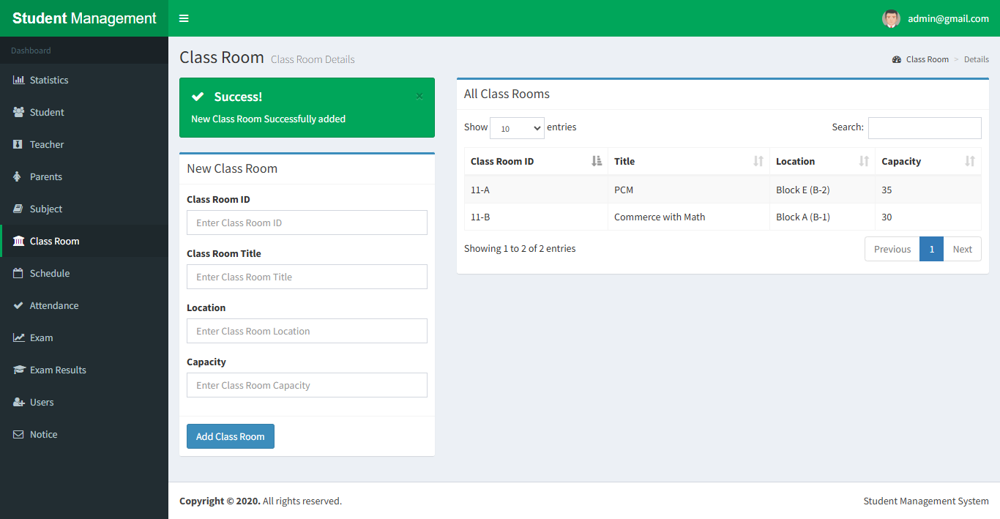

---

### 📅 Schedule Management

  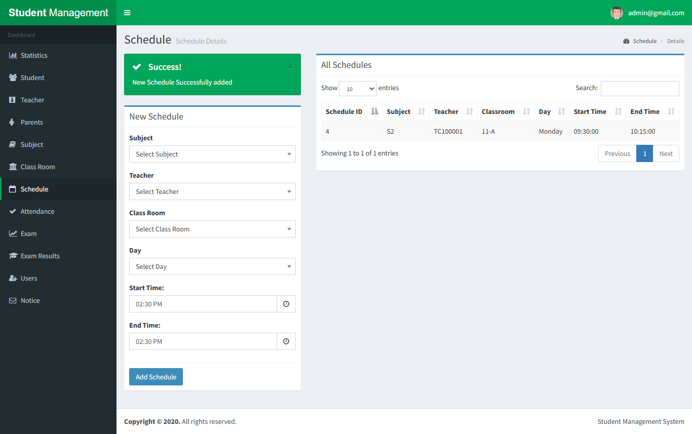

---

### 📅 Attendance Module

  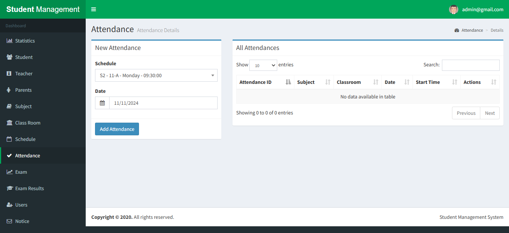

  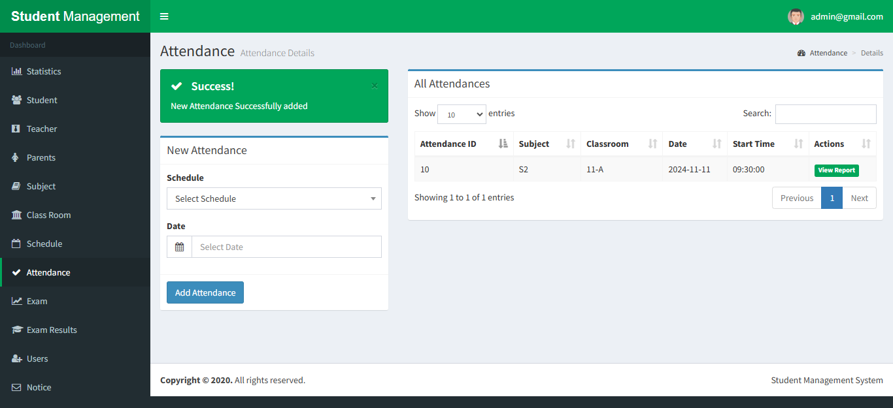

  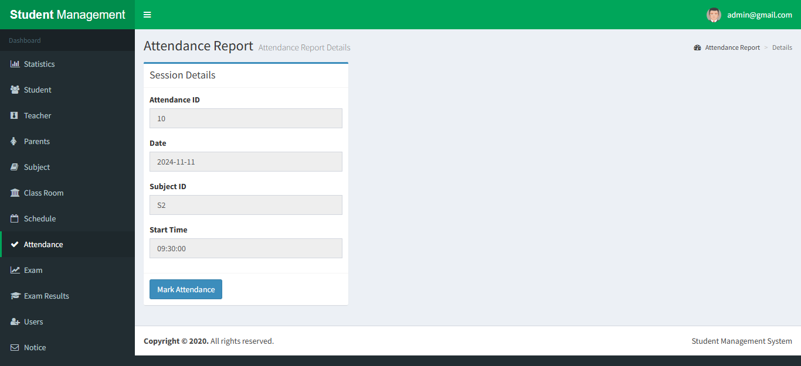

  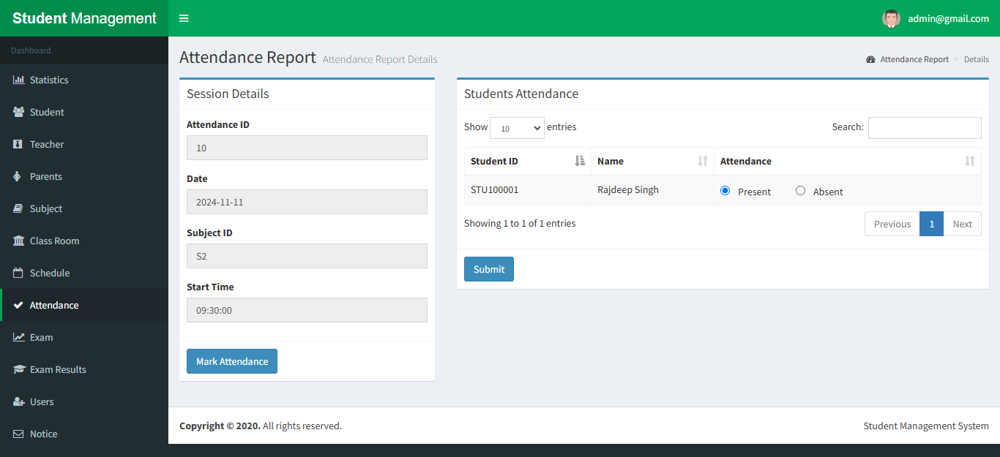

  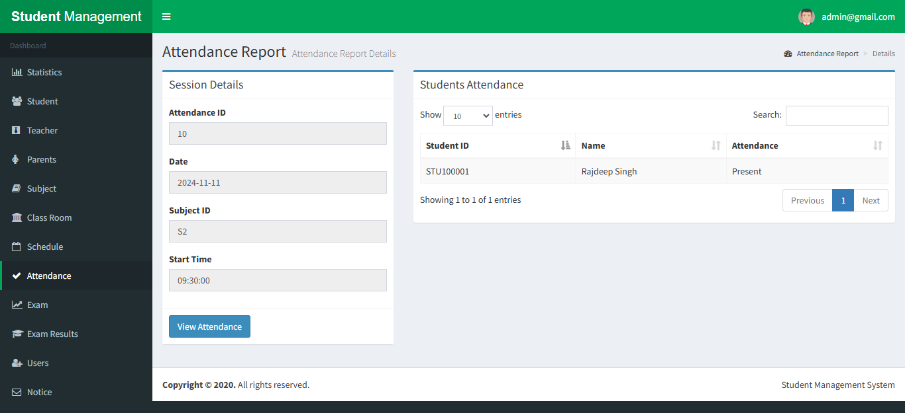

---

### 📝 Exam & Results

  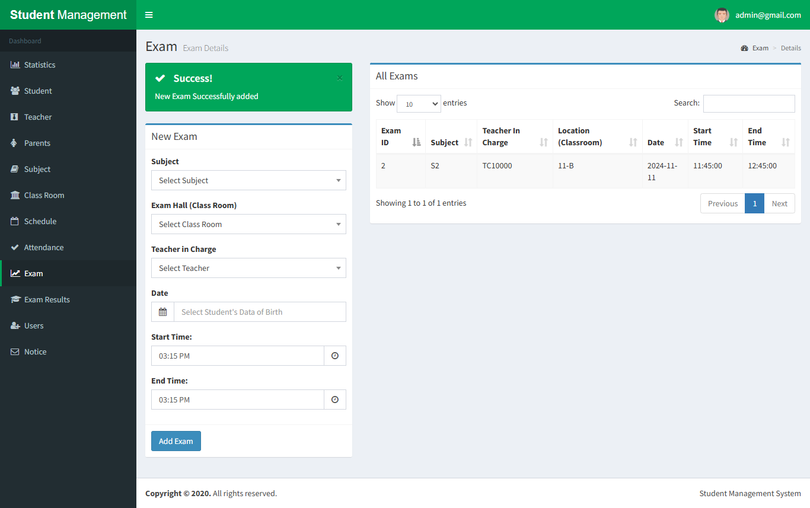

  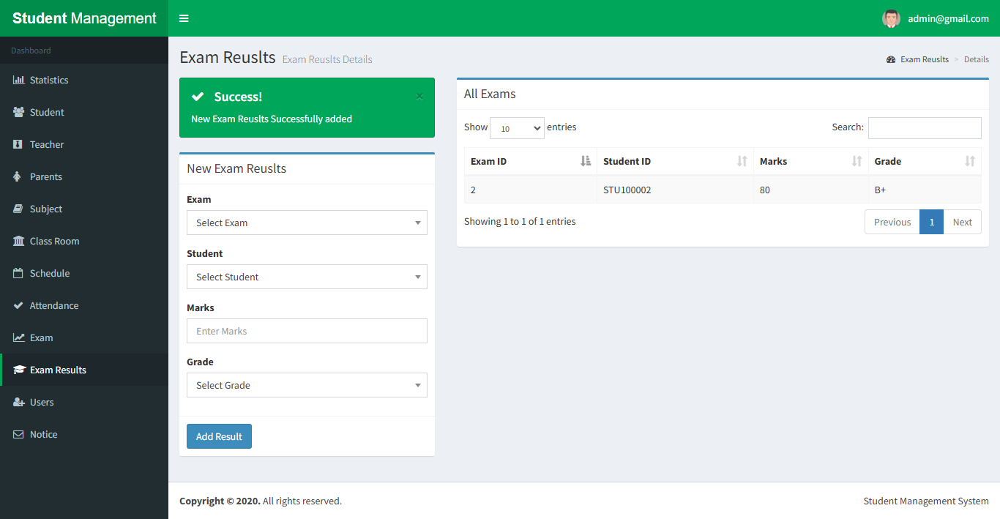

---

### 👨‍🏫 Teacher Dashboard

  

---

### 📊 Reports

  

---

## 📂 How to Add Screenshots

1. Create folder:
